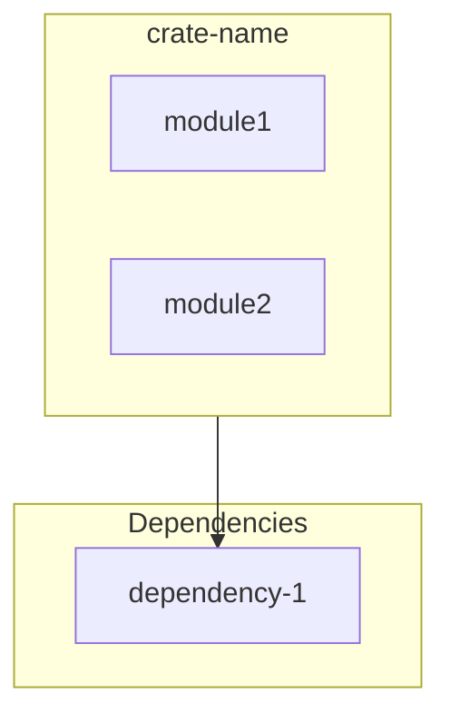
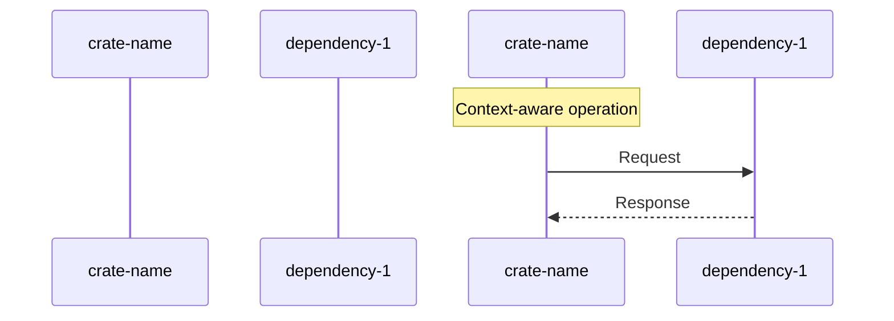

# 🚀 cargo-arc-md

<div align="center">

**AI-Optimized Architecture Documentation Generator for Rust Workspaces**

[](https://www.rust-lang.org)
[](LICENSE)
[](https://crates.io)

*Transform your Cargo workspace into intelligent, AI-readable documentation with interactive diagrams and structured metadata*

</div>

---

## ✨ Features

- **🤖 AI-Optimized Output**: Generates documentation specifically designed for LLM consumption with structured YAML frontmatter and semantic metadata
- **📊 Interactive Visualizations**: Creates SVG dependency diagrams via [cargo-arc](https://github.com/seflue/cargo-arc)
- **🔷 Mermaid Diagrams**: Auto-generates flowcharts and sequence diagrams with context-aware patterns based on crate types
- **📦 Workspace Support**: Handles both single crates and complex multi-crate workspaces
- **🎯 Pattern Recognition**: Detects crate patterns (agent, core, storage, forge, crypto, operator) to generate relevant sequence diagrams
- **🔍 Module Analysis**: Parses Rust source files to extract module structure, functions, structs, enums, and traits
- **🌐 Cross-Platform**: Works on Linux, macOS, and Windows with both Bash and PowerShell scripts
- **⚡ Zero Configuration**: Works out of the box with any Cargo workspace

---

## 🎯 What It Generates

For each crate in your workspace, `cargo-arc-md` generates:

1. **ARCHITECTURE_DIAGRAMS.md** - Complete architecture documentation with:
   - YAML frontmatter with structured crate metadata
   - Mermaid flowchart showing workspace structure
   - Mermaid sequence diagram showing runtime flow
   - Module relationships and dependencies

2. **README.md** - Workspace overview with:
   - List of all workspace members
   - Links to individual crate documentation
   - Regeneration instructions

3. **output-md/[crate-name].md** - Individual crate documentation with:
   - Crate metadata (name, version, type, description)
   - Workspace dependencies and dependents
   - Mermaid flowchart with internal module structure
   - Context-aware Mermaid sequence diagram
   - Summary and key insights

---

## 📦 Installation

### Option 1: Clone and Build

```bash
git clone https://github.com/merovingioops/cargo-arc-md.git
cd cargo-arc-md/generate-docs-helper
cargo build --release
```

The binary will be available at `target/release/cargo-arc-md` (Linux/macOS) or `target/release/cargo-arc-md.exe` (Windows).

### Option 2: Use the Scripts

The repository includes automation scripts that handle building and execution:

- **generate-docs.sh** - Bash script for Linux/macOS
- **generate-docs.ps1** - PowerShell script for Windows

These scripts will:
- Automatically install [cargo-arc](https://github.com/seflue/cargo-arc) if not present
- Build the helper binary if needed
- Generate all documentation

---

## 🚀 Usage

### Quick Start

#### Linux/macOS

```bash
# From your workspace root
./generate-docs.sh
```

#### Windows (PowerShell)

```powershell
# From your workspace root
.\generate-docs.ps1
```

### Advanced Usage

Specify a custom workspace path:

```bash
# Bash
./generate-docs.sh /path/to/your/workspace

# PowerShell
.\generate-docs.ps1 "C:\path\to\your\workspace"
```

### Direct Binary Usage

```bash
cargo-arc-md /path/to/workspace
```

---

## 📊 Generated Output Example

### Crate Documentation Structure

```markdown
# crate-name

Crate description

---
```yaml
crate:
  name: crate-name
  path: path/to/crate
  version: 0.1.0
  type: library
  description: Crate description

workspace_dependencies:
  - dependency-1
  - dependency-2

dependents:
  - dependent-1
```
---

## Flowchart Diagram



---

## Sequence Diagram



---

## Summary and Key Insights

### Purpose
Detailed description of crate purpose

### Key Components
- **module1**: Description
- **module2**: Description

### Dependency Role
Analysis of crate's position in dependency graph

---

## 🧠 Context-Aware Sequence Diagrams

The generator intelligently creates sequence diagrams based on crate naming patterns:

| Pattern | Sequence Diagram Focus |
|---------|----------------------|
| **agent/beacon** | Key exchange, encrypted communication, task execution loop, memory cleanup |
| **core/server** | API request handling, storage operations, response management |
| **storage/db** | Cache check, cache hit/miss logic, database queries |
| **forge/generator** | Configuration parsing, generation process, artifact assembly |
| **crypto/encryption** | Key operations, encryption/decryption, memory safety |
| **operator/client** | User interaction, API communication, WebSocket updates, UI state |

---

## 🏗️ Architecture

```
generate-docs-helper/
├── src/
│   └── main.rs              # Main generator logic
├── Cargo.toml               # Rust dependencies
├── target/release/
│   └── cargo-arc-md         # Compiled binary
├── generate-docs.sh         # Bash automation script
└── generate-docs.ps1        # PowerShell automation script
```

### Core Components

1. **Metadata Parser**: Extracts crate information from Cargo.toml
2. **Module Analyzer**: Parses Rust source files to build module structure
3. **Dependency Mapper**: Builds workspace dependency graph using cargo-metadata
4. **Diagram Generator**: Creates Mermaid flowcharts and sequence diagrams
5. **Pattern Matcher**: Identifies crate patterns for context-aware diagrams

---

## 🔧 Dependencies

- **cargo-arc**: SVG dependency visualization
- **cargo_metadata**: Cargo workspace metadata parsing
- **anyhow**: Error handling
- **serde/serde_json**: Serialization
- **syn**: Rust source code parsing

---

## 📝 Requirements

- Rust 1.70 or later
- Cargo
- [cargo-arc](https://github.com/seflue/cargo-arc) (auto-installed by scripts)

---

## ✨ Fix version 0.1.1

- The main problem was in parse_crate_modules (line 492): it was only reading .rs plain text files in src/ — it wasn't recursively exploring subdirectories. That's why src/xxx/, src/yyy/, src/zzzz/, etc., were missing.

---

## 🤝 Contributing

Contributions are welcome! Please feel free to submit a Pull Request.

1. Fork the repository
2. Create your feature branch (`git checkout -b feature/AmazingFeature`)
3. Commit your changes (`git commit -m 'Add some AmazingFeature'`)
4. Push to the branch (`git push origin feature/AmazingFeature`)
5. Open a Pull Request

---

## 📄 License

This project is licensed under the MIT License - see the [LICENSE](LICENSE.md) file for details.

---

## 🙏 Acknowledgments

- [cargo-arc](https://github.com/seflue/cargo-arc) for the excellent dependency visualization tool
- The Rust community for the amazing ecosystem

---

## 📚 Related Projects

- [cargo-arc](https://github.com/seflue/cargo-arc) - Interactive SVG dependency diagrams
- [cargo-metadata](https://github.com/oli-obk/cargo_metadata) - Cargo workspace metadata access
- [mermaid-js](https://mermaid.js.org/) - Diagram generation and documentation

---

## 📞 Support

If you encounter any issues or have questions, please open an issue on GitHub.

---

<div align="center">

**Built with ❤️ for the Rust community**

</div>
